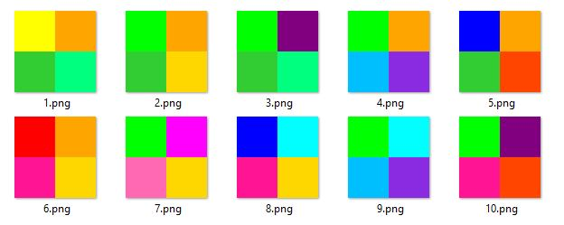

#  ‧͙⁺˚*･༓☾ Pretty Squares Image Engine



Welcome to my first image engine!  
This Python program generates unique and vibrant square images by combining various layers from different trait directories (16 layers in total), and saves them to the user's local machine.  It also generates a JSON metadata file for each generated image, and saves them to the same directory.

##  ‧͙⁺˚*･༓☾ How It Works

The image engine works by selecting random layers from four different subdirectories.   
It then stacks these layers together to create a square image with four colors.  
The engine keeps track of previously used combinations, preventing duplicates.  

##  ‧͙⁺˚*･༓☾ Requirements

- Python 3.11
- PIL (Python Imaging Library)

##  ‧͙⁺˚*･༓☾ Installation

1. Make sure you have Python installed on your system.
2. Install the required PIL library by running the following command:

```bash
pip install pillow
```  

Clone this repo to your machine, replacing your_username in the url below with... your username.  

```bash
git clone https://github.com/your_username/image-engine.git
```

##  ‧͙⁺˚*･༓☾ Usage

The original layers and their directory are already included for you to play with.  
Or, you can prepare your own trait images by organizing them into four subdirectories:   TopLeft, TopRight, BottomRight, and BottomLeft, within a directory called traits, or changing these names if you like within the program to reflect your four subdirectories.

Run the image engine by providing the trait_directory and the number of images you want to generate (num_images) in the __main__ block:

```bash
if __name__ == "__main__":
    trait_directory = "traits"
    num_images = 10
    image_engine(trait_directory, num_images)
```

I like to run this from the console.

Open a terminal within the project folder and run the program using the command:

```bash
python image-engine.py
```

The generated images will be saved in a directory called "finished" within the project folder, numbered sequentially starting at 1.  
A JSON metadata file is also created for each generated image, and will be saved into the same "finished" folder.

##  ‧͙⁺˚*･༓☾ Customization

Feel free to customize the size of the layers and output images by modifying the layer_size and combined_image dimensions in the script.
You can also create your own trait images to the trait directories.

##  ‧͙⁺˚*･༓☾ License
This project is licensed under the MIT License.

#  ‧͙⁺˚*･༓☾ Have fun!
